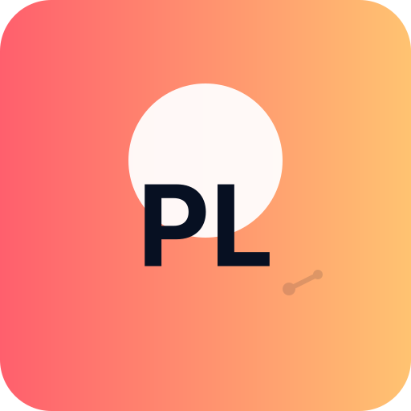
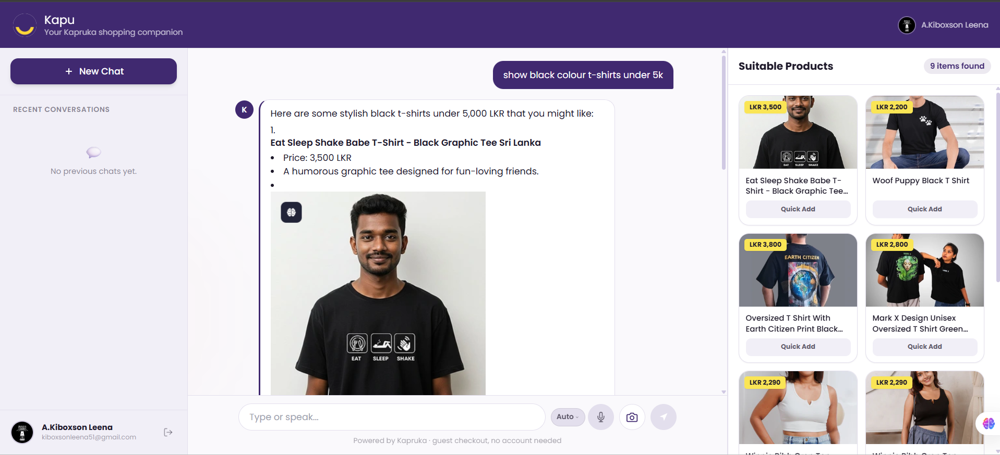
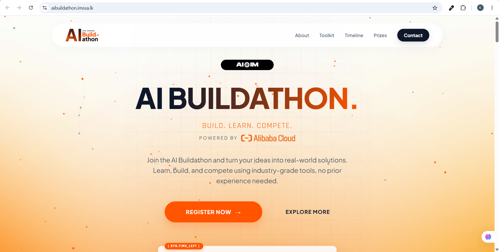
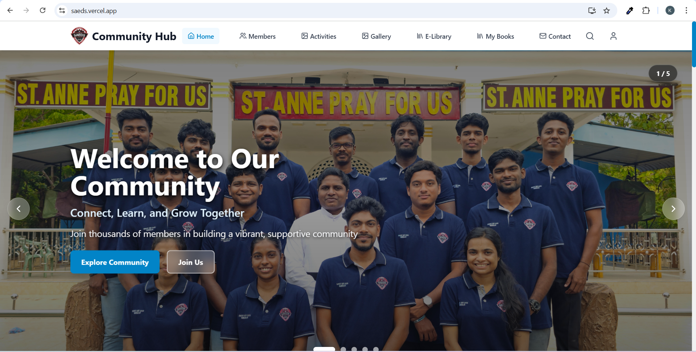

# Hi, I’m Prakash 👋

  
  <h2>Prakash Leena — AI & Machine Learning Enthusiast · Creative Developer</h2>
  
Design-first dev building playful, production-ready ML demos and data-driven experiences.

  

    🔭 Currently: shifting focus to ML systems & interactive model demos • 🌱 Learning: production ML workflows, WebGL visualizations • ⚡ Fun: turning datasets into playful interfaces
  

---

## Featured Work (AI & ML focus)
Below are highlights you can showcase — click to explore the repo or demo.

### 🤖 AI-Buildathon — Portal for AI Buildathon
An interactive portal and resources for the AI Buildathon — demos, submission guides, and event materials.  
[Repo](https://github.com/PrakashLeena/AI-Buildathon)

### ⚙️ skills-integrate-mcp-with-copilot — Model Context Protocol Exercise
Exercise demonstrating integration of Model Context Protocol with GitHub Copilot and related tooling.  
[Repo](https://github.com/PrakashLeena/skills-integrate-mcp-with-copilot)

### 🌐 portfolio — Personal portfolio website
My showcase website with project listings and contact information.  
[Repo](https://github.com/PrakashLeena/portfolio)

(If you want different projects featured or alternate descriptions, tell me which repos to swap in.)

---

## Tech & Tools (ML + Web)

---

## Portfolio Gallery
<!-- Add images in assets/ and reference them here -->

  
  
  

---

## GitHub Stats

---

## Roadmap — My ML Focus
- Short-term: build interactive demos of small, interpretable models (browser + WebAssembly).
- Mid-term: productionize model training pipelines and lightweight serving.
- Long-term: design delightful, privacy-respecting ML experiences for everyday users.

---

## Contact & Links
- Website: https://kiboxson.vercel.app
- Email: kiboxsonleena2004@gmail.com
- LinkedIn: https://www.linkedin.com/in/kiboxson-leena5111

---

Thanks for stopping by — if you want different featured projects or preview images I can update them next.
